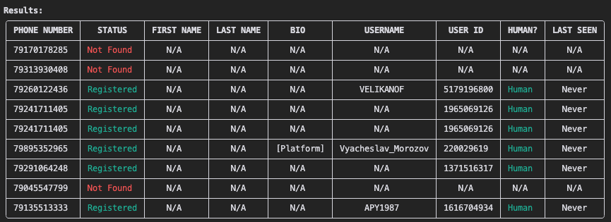

# 📲telegrab

This is an OSINT tool for investigative journalists to check if phone numbers are registered on Telegram using Telegram's official API. Telegrab provides a user-friendly terminal interface with colored output and multiple input methods. It also allows you to check multiple numbers at once, and identify whether accounts are bots or human users.


*The Telegrab command-line interface running in a terminal*

Telegrab is based on a [Bellingcat tool](https://github.com/bellingcat/telegram-phone-number-checker). This is a more user-friendly version of that tool which I plan to develop with more features to further enrich numbers using APIs from other services. Thanks to Bellingcat for making the original tool available. 

## ✨ Features

- Check if phone numbers are registered on Telegram
- Detect whether accounts are bots or human users
- Identify and display ISO country codes (e.g., "GB", "RU", "US") for each number
- View user's last seen status:
  - Exact timestamp when privacy settings allow
  - Or one of these timeframes based on privacy settings:
    - "Online"
    - "Last seen recently"
    - "Last seen in the last week"
    - "Last seen in the last month"
    - "Last seen a long time ago"
- See user bio information when available
- Debug mode for detailed API responses
- Rate limiting protection with exponential backoff
- Colored terminal output
- Multiple input methods (interactive, file, command line)

## 📖 How It Works

Telegrab uses a Python library called Telethon to interact with Telegram's official API. Here's what happens when you search for a phone number:

1. Telegrab logs into Telegram using your account (Telegram will send a verification code to your device upon first use)

2. For each phone number you want to check, the tool:
   - Temporarily adds the number as a contact in your Telegram account
   - Retrieves any available information about that user
   - Immediately removes the number from your contacts
   - Shows you what it found in a neat table

This is similar to what happens when you add a new contact in Telegram - you can see their profile info if they have an account. Telegrab does this automatically, in seconds, and shows you the results while maintaining a low profile. 

> ⚠️ **Consider using a burner or VoIP number for stronger opsec. Batch searching a high amount of numbers at once could trigger a Telegram ban, use with caution!**

**Privacy Note:** The tool only uses your Telegram account to check numbers. It doesn't:
- Send messages to anyone
- Keep the numbers in your contacts
- Change any of your account settings
- Store any data permanently

Telegrab uses the official Telegram API through Telethon, which means it follows all of Telegram's rules and rate limits. This is why you sometimes need to wait between checking multiple numbers - Telegram has limits on how quickly you can look up users.

## 🔧 Prerequisites

- Python 3.7 or higher
- A Telegram account
- Telegram API credentials (API ID and API Hash)
- Basic familiarity with terminal commands

## ⚙️ Setup

1. Clone the repository:
```bash
git clone https://github.com/pearswick/telegrab.git
cd telegrab
```

2. Create and activate a virtual environment:

**Windows:**
```bash
python -m venv venv
.\venv\Scripts\activate
```

**macOS/Linux:**
```bash
python3 -m venv venv
source venv/bin/activate
```

3. Install required packages:
```bash
pip install -r requirements.txt
```

4. Get your Telegram API credentials:
   - Visit [https://my.telegram.org/auth](https://my.telegram.org/auth)
   - Log in with your phone number
   - Go to 'API development tools'
   - Fill in your application details:
     - App title: Can be anything (e.g., "telegrab-api")
     - Short name: Can be anything (e.g., "telegrabber")
     - URL: Can be blank
     - Platform: Choose "Desktop"
     - Description: Can be brief (e.g., "Research usage")
   - Accept the terms of service
   - Copy your API ID (a number) and API Hash (a long string)
   - Keep these credentials secure and never share them

5. Create a `.env` file in the project directory with your credentials:
```plaintext
API_ID=your_api_id
API_KEY=your_api_hash
YOUR_PHONE=your_phone_number  # Format: 1234567890 (remove the +)
```

## 🚀 Usage

When you first run the tool, Telegrab will send a verification code to your Telegram account. You'll need to enter this code in the terminal to authenticate. This is a one-time process for each session.

### Single Number Search
```bash
python telegrab.py
```
When prompted, enter a single phone number. The tool automatically removes spaces and special characters, so these formats all work:
- 447755570626
- +44 7755 570626
- +44-7755-570626

### Batch Searching

You can check multiple numbers at once in two ways:

1. **Comma-separated input:**
```bash
python telegrab.py -n "447755570626,447755570627,447755570628"
```
Or when prompted, enter multiple numbers separated by commas:
```
Enter phone number (or comma-separated numbers): +44 7755 570626, +44 7755 570627
```

2. **Text file input:**
Create a file (e.g., `numbers.txt`) with one number per line:
```plaintext
+44 7755 570626
+44 7755 570627
447755570628
```
Then run:
```bash
python telegrab.py -f numbers.txt
```



*The Telegrab interface showing batch search results using Russian numbers from breach data*

### Additional Options

1. Run without colours:
```bash
python telegrab.py --no-color
```

2. Enable debug mode (shows detailed API responses):
```bash
python telegrab.py --debug
```

3. Get help about available options:
```bash
python telegrab.py -h
```

**⚠️ Important Notes:**
- Create your `.env` file first and make sure it is in the same directory
- Ensure you're in your virtual environment before running
- Rate limiting may still occur if checking many numbers quickly, consider waiting between batch checks

## 🤝 Contributing

I plan to add more Telegram python tools to Telegrab in the future. Feel free to reach out for suggestions or contributions.

## 📄 License

See [License.MD](License.MD)